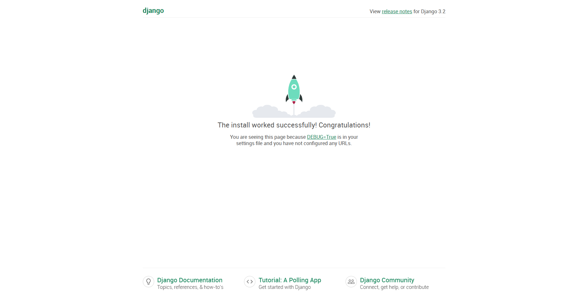

# 项目3 Web应用程序

## 一 Django入门

### 1 创建项目

```bash
django-admin.exe startproject learning_log .
```

### 2 创建数据库

```bash
python manage.py migrate
```
### 3 运行项目
```
python manage.py runserver
```




### 4 创建应用程序

```bash
python manage.py startapp learning_logs
```

### 5 定义模型

```python
# model.py
from django.contrib.auth.models import User
from django.db import models

class Topic(models.Model):
    """主题"""
    text = models.CharField(max_length=200)  # 由字符或文本组成的数据
    date_added = models.DateTimeField(auto_now_add=True)  # 记录日期和时间的数据

    owner = models.ForeignKey(User, on_delete=models.CASCADE)  # 外键参考User

    def __str__(self):
        """返回模型的字符串表示"""
        return self.text
    
    
class Entry(models.Model):
    """条目"""
    topic = models.ForeignKey(Topic, on_delete=models.CASCADE)  # 外键参考Topic

    text = models.TextField()  # TextField实例
    date_added = models.DateTimeField(auto_now_add=True)

    # Meta存储用于管理模型的额外信息
    class Meta:
        verbose_name_plural = 'entries'

    def __str__(self):
        """返回模型的字符串表示"""
        return self.text[:50] + "..."
```

### 6 激活模型

```python
# settings.py
INSTALLED_APPS = [

    # 我的应用程序
    'learning_logs',
        
    # --skip--
]
```

```bash
python manage.py makemigrations learning_logs
python manage.py migrate
```

### 7 Django管理网站

#### 1. 创建超级用户

```bash
python manage.py createsuperuser
```

> ll_admin admin

#### 2. 向管理网站注册模型

```python
# admin.py
from learning_logs.models import Topic, Entry

from learning_logs.models import Topic
admin.site.register(Topic)
```

#### 3. 添加主题

### 8 Django shell

```python
from learning_logs.models import Topic
Topic.objects.all()
```

## 二 创建网页：学习笔记主页

### 1 映射URL

```python
"""定义learning_log的URL模式"""

# urls.py 定义learning_log的URL模式

from django.contrib import admin
from django.urls import path, include

urlpatterns = [
    path('admin/', admin.site.urls),
    
    path(r'', include('learning_logs.urls', namespace='learning_logs')),
]
```

#### 1 URL模式

```python
"""定义learning_logs的URL模式"""

# urls.py learning_logs

from django.conf.urls import url
from . import views

app_name = "learning_logs"

urlpatterns = [
    # 主页
    url(r'^$', views.index, name='index'),
]
```

#### 2 编写视图

```python
# view.py
from django.shortcuts import render

# Create your views here.
from learning_logs.models import Topic


def index(request):
    """学习笔记的主页"""
    return render(request, 'learning_logs/index.html')
```

### 2 模板继承

#### 1. 父模板

```html
<!--base.html-->
<body>
<p>
    <a href="">诗文记录</a>
</p>


    

</body>
```

#### 2. 子模板
```html
<!--index.html-->
<body>




<p>诗文学习记录可以帮助跟踪的学习情况。</p>


</body>
```

### 3 显示所有主题的页面

#### 1 URL模式

```python
"""定义learning_logs的URL模式"""

# urls.py learning_logs

from django.conf.urls import url
from . import views

app_name = "learning_logs"

urlpatterns = [
	# --skip--
    

    # 显示所有的主题
    url(r'^topics/$', views.topics, name='topics'),
]
```
#### 2 视图

```python
# view.py

from django.shortcuts import render

# Create your views here.
from learning_logs.models import Topic


# --skip--


def topics(request):
    """显示所有的主题"""
    topics = Topic.objects.filter(owner=request.user).order_by('date_added')
    context = {'topics': topics}
    return render(request, 'learning_logs/topics.html', context)
```

#### 3 模板

```html
<!--topics.html-->
<body>
    



<p>主题</p>

<ul>
    
    <li><a href="">{{ topic }}</a></li>
    
    <li>No topics have been added yet.</li>

</ul>


</body>
```

#### 4 修改base.html

```HTML
<!--base.html-->
<body>
<p>
    <a href="">诗文记录</a>
    <a href="">主题</a>
</p>




```

### 4 显示特定主题的页面
#### 1 URL模式

```python
"""定义learning_logs的URL模式"""

# urls.py learning_logs

from django.conf.urls import url
from . import views

app_name = "learning_logs"

urlpatterns = [
    # --skip--

    
    # 特定主题的详细页面
    url(r'^topics/(?P<topic_id>\d+)/$', views.topic, name='topic'),
]

```

#### 2 视图

```python
# view.py
from django.shortcuts import render

# Create your views here.
from learning_logs.models import Topic


# --skip--


def topic(request, topic_id):
    """显示单个主题及其所有的条目"""
    topic = Topic.objects.get(id=topic_id)
    entries = topic.entry_set.order_by('-date_added')
    context = {'topic': topic, 'entries': entries}
    return render(request, 'learning_logs/topic.html', context)
```

#### 3 模板

```html
<!--topic.html-->

<body>
    

    
<p>条目</p>
    

<ul>
    
    <li>
        <p>{{ entry.date_added|date:'M d, Y H:i' }}</p>
        <p>{{ entry.text|linebreaks }}</p>
    </li>
    
    <li>
        There are no entries for this topic yet.
    </li>
    
</ul>

</body>
```

#### 4 修改topics.html

```html
<!--topics.html-->

<body>




    
<p>主题</p>

<ul>
    
    <li><a href="">{{ topic }}</a></li>
    
    <li>No topics have been added yet.</li>

</ul>


</body>
```

